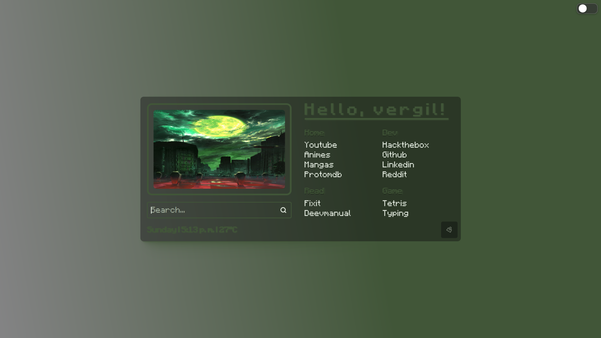

     <h1> 🌸 「契」Night 🌸</h1>
 

  <picture>
    
  </picture>

# 🌿 Sections

- 🌸 [Presentation](https://github.com/Shentxt/--Nights/tree/main?tab=readme-ov-file#presentation)
- 🌸 [Key](https://github.com/Shentxt/--Nights/tree/main?tab=readme-ov-file#keys-search)
- 🌸 [Galery]()
- 🌸 [Informations](https://github.com/Shentxt/--Nights/tree/main?tab=readme-ov-file#contact-me)

# 🌿 Presentation

<h3> Nights is a homepage that adapts to your chosen image, offering a clean yet elegant style with smooth transitions. </h3>

  <picture>
    
  </picture>

# ━────────────━────────────━━────────────━━────────────━━────────────

# 🌿 Key-Search

> :information_source: **Don’t use the special characters below if you want a regular search.**

|     Search on  |    Key       |
|  :----------:  | :----------: |
|  Use Pinterest |  p! |
|  Use Youtube   |  Y! |
|  Use Reddit    |  R! |
|  Use Gpt       |  G! |

# ━────────────━────────────━━────────────━━────────────━━────────────

# 🌿 Contact Me

- 🌸 [Linkelind](https://www.linkedin.com/in/federico-p-065a42217/)

# 🌿 Based

- 🌸 [PrettyCoffe](https://github.com/PrettyCoffee/dandadan-startpage) 
- 🌸 [Alljavi](https://github.com/AllJavi/tartarus-startpage)
- 🌸 [B-Coimbra](https://github.com/b-coimbra/dawn)
- 🌸 [AmeerMoustafa](https://github.com/AmeerMoustafa/Forbidden-startpage)